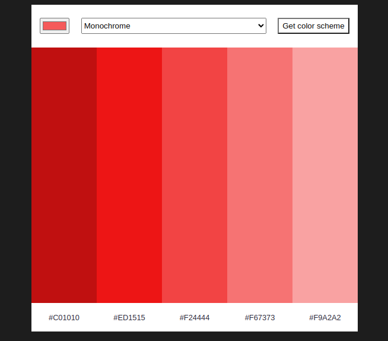

###COLOR PICKER
It's a solo project from a scrimba course. You pick an color from the **color picker** a theme from a **dropdown menu** and send a request to the site https://www.thecolorapi.com/ for an object with 5 colors, we then paint the columns with them.

##New technologies learned
-API
-REST

##Screenshot
